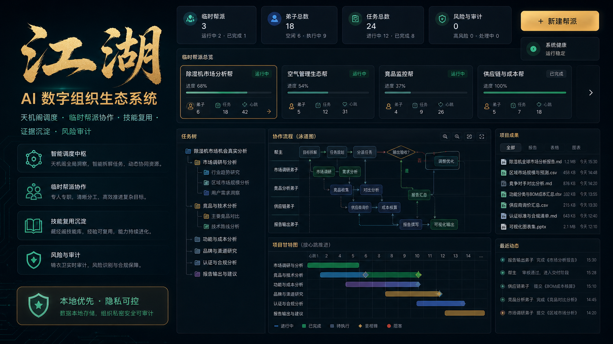

# 江湖



江湖是一个本地优先的 **AI 数字组织生态系统**。

用户不需要自己搭工作流、管理一堆 agent、理解复杂调度图。你只需要把目标交给天机阁，系统会像临时召集一个江湖帮派一样，完成需求澄清、任务拆解、弟子分工、技能调用、预算控制、过程监督、结果交付和经验沉淀。

> AI 不是一个聊天框，而是一套能分工、能协作、能复盘、能进化的数字劳动力组织。

## 它不是什么

- 不是普通 chatbot
- 不是传统 workflow 画布
- 不是单纯 agent 群聊
- 不是云端托管平台
- 不是用古风皮肤包装的自动化脚本

## 核心思想

- **低认知负担**：人只提出目标和做关键决策。
- **组织化执行**：复杂任务由临时帮派承接，帮主负责推进。
- **专人专事**：弟子职责单一，减少上下文污染。
- **证据驱动**：结果要能追溯来源、验收标准和交付物。
- **本地优先**：默认在自己的机器上运行，数据和 API Key 不上传。
- **异常升级**：任务偏移、预算异常、输出风险由锦衣卫审计。

## 江湖结构

| 江湖概念 | 作用 |
| --- | --- |
| 天机阁 | 用户入口，负责理解目标、澄清需求、成立帮派、验收结果 |
| 锦衣卫 | 安全与风险审计，和天机阁平级互相制衡 |
| 帮派 | 围绕一次委托临时成立的项目组 |
| 帮主 | 帮派负责人，负责计划、分工、监督、纠偏和交付 |
| 弟子 | 最小执行单元，专人专事，按任务树协作 |
| 客栈 | 公共人才市场，管理弟子档案、履历和招募 |
| 藏经阁 | 技能库，管理 Skills、SOP、模板、提示词和经验 |
| 钱庄 | 预算与成本系统，管理铜钱、银两、金票和流水 |
| 龙门镖局 | 帮派之间的信息传递工具 |

## 典型流程

```text
用户提出目标
→ 需求澄清师整理需求文档
→ 用户确认
→ 天机阁成立临时帮派
→ 帮主分析目标并制定计划
→ 帮主从客栈选择弟子
→ 帮主从藏经阁分配技能
→ 钱庄拨付预算
→ 弟子按协作流程执行
→ 帮主监督、检查、纠偏
→ 天机阁验收
→ 锦衣卫审计风险
→ 输出成果
→ 履历、记忆、经验归档
→ 帮派解散
```

## 功能亮点

- 天机阁对话：通过对话了解江湖全局、发起委托、创建和管理帮派。
- 帮主管理处：集中管理委托目标、帮主对话、协作流程、项目甘特、弟子训练、任务检查和项目成果。
- 任务树：支持父子任务、负责人、预计完成时间、验收标准和结果反馈。
- 协作流程：用可视化节点展示弟子上下游关系，支持判断节点和人工调整。
- 项目成果：将报告、索引、验收记录等成果文件集中展示。
- 客栈：只处理人、角色、弟子、履历、能力和招募关系。
- 藏经阁：存放类似 agent skills 的可复用技能资产。
- 钱庄：只处理预算、成本、流水和内部资源，不连接真实世界资金。
- 锦衣卫：处理风险、看守、囚禁、审计和复验，不替代天机阁执行任务。

## 本地运行

```bash
npm install
npm run dev:room
```

默认访问：

- 本机：`http://127.0.0.1:4700/`
- 手机同局域网访问：`http://你的电脑局域网IP:4700/`

如果需要手机访问，可以绑定局域网：

```bash
COMPANY_BIND_HOST=0.0.0.0 npm run dev:room
```

Windows 可使用：

```bash
npm run dev:room:win
```

## AI/API 配置

江湖不会把 API Key 上传到仓库。用户需要在自己的本地或部署环境中配置模型能力。

支持的配置方式包括：

- 本地环境变量，例如 `OPENAI_API_KEY`、`ANTHROPIC_API_KEY`、`MIMO_API_KEY`
- 应用设置页中保存的本地凭据
- Claude Code / Codex / MiMo 等已经配置好的本机环境

MiMo 模型示例：

- `MiMo-V2.5-Pro`
- `MiMo-V2.5`
- `MiMo-V2-Pro`

不要使用不支持的 `mimo-v2-flash`。

## 开源安全边界

本仓库只应包含源码、文档、示例配置和公开素材。以下内容不能提交：

- `.company-local-*` 本地运行数据
- 本地数据库、任务记录、帮派成果、弟子记忆
- `.env`、API Key、访问 token、钱包私钥
- 本机路径、临时截图、E2E 录屏和调试报告
- 真实业务调研报告和未脱敏客户数据

相关规则已经写入 `.gitignore` 和 `.dockerignore`。

## 公网体验部署

公网部署时不要直接暴露本机 `4700` 端口。推荐使用 Docker、HTTPS 反向代理和独立访问凭证。

- 部署说明：[docs/PUBLIC_DEPLOYMENT.md](docs/PUBLIC_DEPLOYMENT.md)
- Compose 文件：`docker-compose.public.yml`
- 环境变量模板：`deploy/public.env.example`

## 常用命令

```bash
npm run typecheck
npm test
npm run build
npm run dev:room
```

## 贡献

欢迎贡献：

- 本地 agent 调度能力
- 藏经阁 Skills 体系
- 任务树、协作流程和成果展示
- 证据采集与质量评分
- 锦衣卫风险审计
- 文档、测试和部署体验

请阅读 [CONTRIBUTING.md](CONTRIBUTING.md)。

## 许可证

本项目使用 MIT License。详见 [LICENSE](LICENSE)。
